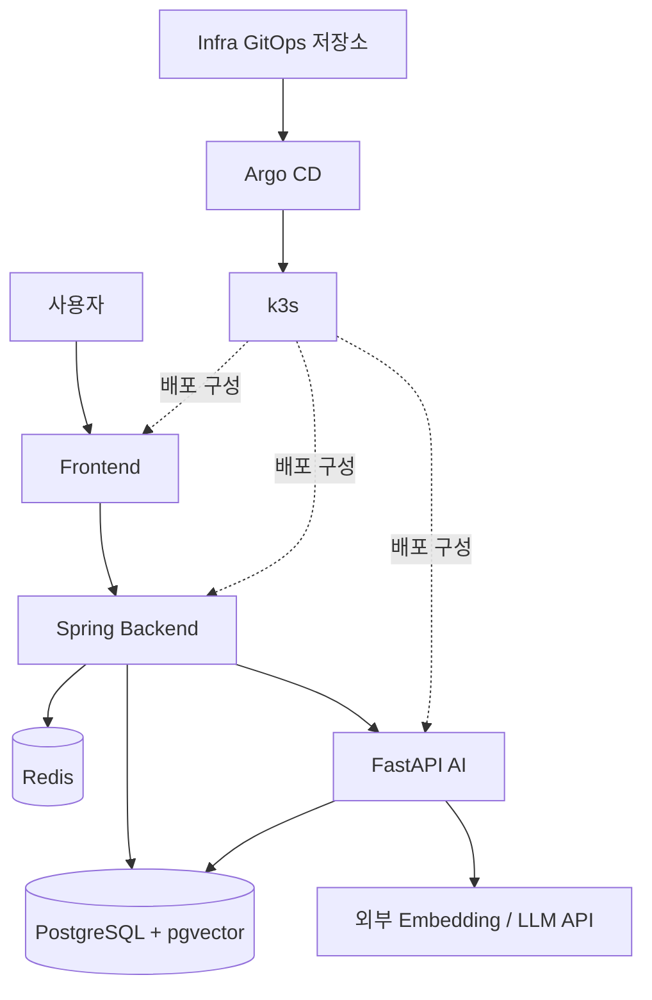

# PinLog

장소를 저장한 맥락까지 기록해, 이름이 떠오르지 않아도 다시 찾고 새로운 장소를 발견하도록 돕는 서비스입니다.

PinLog은 공개 문서에 정의된 MVP 핵심 흐름과 설계를 구현해 나가고 있습니다.

## 서비스 가치

- 장소만이 아니라 저장한 이유와 경험을 맥락으로 남깁니다.
- 장소명을 기억하지 못해도 내 맥락을 자연어로 검색합니다.
- 신원과 맥락 원문을 드러내지 않는 익명 컬렉션에서 취향을 발견합니다.
- 발견한 장소에는 타인의 기록을 복사하지 않고 나만의 맥락을 더합니다.

## MVP 핵심 흐름

- 기록: 장소 검색 → 장소 선택 → 맥락 작성 → 레코드 저장 → 비동기 키워드·임베딩 생성
- 검색: 자연어 질의 → 내 맥락의 의미 검색 → 관련 레코드 확인
- 발견: 익명 컬렉션 탐색 → 장소 선택 → 내 맥락 작성 → 내 레코드로 저장

AI 처리는 저장 이후 비동기로 진행되며, MVP 설계에서는 AI 결과가 기본 기록 흐름의 완료 조건이 아닙니다.

## 핵심 개념

- Place: 지도에서 찾은 실제 장소의 공용 정보
- Record: 사용자와 장소를 연결하며 하나 이상의 Context를 가진 기록
- Context: 장소를 저장한 이유나 경험을 담는 불변 서술 단위
- Keyword: AI가 사전 정의 목록에서 매핑하는 비식별화 표현
- Collection: 하나 이상의 Record를 묶은 공개 그룹
- Shelf: 한 사용자가 발행한 Collection의 목록
- Library: 내 Shelf와 팔로우한 Shelf를 함께 보는 개인 공간
- Feed: 발행된 Collection을 익명으로 발견하는 영역

## 아키텍처

MVP 요청은 Frontend에서 Spring Backend로 전달됩니다. Client는 FastAPI AI를 직접 호출하지 않으며, Spring Backend가 Core 도메인과 최종 응답을 담당합니다.



k3s 배포 구성은 Infra 저장소에 선언하고 Argo CD가 GitOps 방식으로 반영하도록 설계합니다.

### 텍스트 대체 설명

```text
사용자 → Frontend → Spring Backend
Spring Backend → PostgreSQL + pgvector
Spring Backend → Redis
Spring Backend → FastAPI AI → PostgreSQL + pgvector
FastAPI AI → 외부 Embedding / LLM API
Infra GitOps 저장소 → Argo CD → k3s 배포 구성
```

## 제품 저장소

- [front](https://github.com/Team-PinLog/front) — PinLog Frontend
- [back](https://github.com/Team-PinLog/back) — Spring Boot 기반 Core Backend
- [ai](https://github.com/Team-PinLog/ai) — FastAPI 기반 AI 처리와 자연어 검색
- [docs](https://github.com/Team-PinLog/docs) — 제품 기획, 정책, 용어와 파트 간 공식 계약
- [infra](https://github.com/Team-PinLog/infra) — k3s·Argo CD 기반 GitOps 배포 구성
- [mockup](https://github.com/Team-PinLog/mockup)

## 팀 도구와 지식

제품 구성요소와 별도로 협업과 지식 관리를 위한 도구를 관리합니다.

- [cowork](https://github.com/Team-PinLog/cowork) — 팀 작업 등록을 돕는 도구
- [pico-agent](https://github.com/Team-PinLog/pico-agent) — 출처 중심의 로컬 지식 시스템

## 공식 문서

제품의 범위, 정책, 용어와 설계 계약은 [PinLog 공식 문서에서 확인하세요](https://github.com/Team-PinLog/docs/blob/main/README.md).
